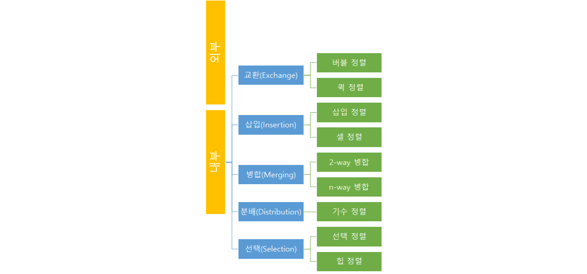

1.  정렬(Sort)

1-1. 정렬의 개념

- 정렬은 내부정렬(internal sort)과 외부정렬(external sort)로 나누어진다.
- 내부정렬은 작업을 하는 동안 데이터를 모두 내부 메모리(주 기억공간)에 저장한다.
-  외부정렬은 정렬할 데이터의 양이 많기 때문에 소량의 데이터만 내부 메모리에 저장하고 대부분의 데이터는 외부 기억장치에 저장한다.

- 내부정렬은 정렬 방법론에 따라 몇 가지로 나누어 진다. 
- Knuth는 5가지로 나누었으며, 삽입(insertion), 선택(selection), 교환(exchange), 병합(merging), 분배(distribution)이다.

- 데이터를 정렬하는 방법은 작은 값이 앞에오는 오름차순(asending order)과 큰 값이 앞에오는 내림차순(descending order)이고, 이것을 정렬 순서라 한다.
- 데이터의 입력순서대로 정렬이 되는 안정성. 이 안정성이 있는 정렬의 종류는 선택정렬, 삽입정렬, 버블정령이다. 
- 효율이 가장 높은 정렬 알고리즘은 퀵 정렬이며 O(nlogn)의 시간복잡도를 가진다.

- 정렬을 수행하는 동안 데이터들은 여러 번에 걸쳐서 차례로 데이터 값이 점검된다. 한 차례 데이터들이 차례로 점검되는 과정을 소트패스(sort pass)라 한다.

1-2. 삽입정렬(insertion sort)

- 삽입정렬은 카드놀이를 할 때 자주 쓰이게되는 정렬 방법이다.
- 카드뭉치에서 카드를 한 장씩 뽑아 손에 들고 있는 카드들 사이의 적절한 위치에 끼워 넣는 방법이다.
- 